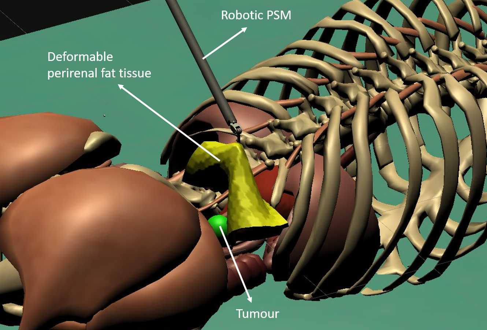
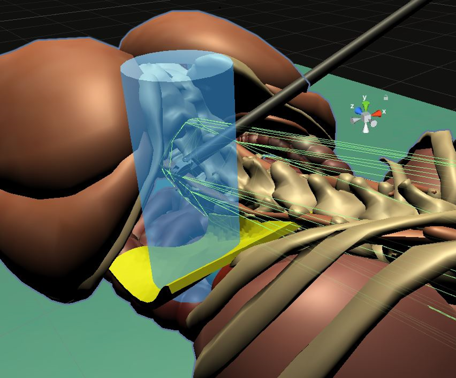

# Safe RL for surgery

<figure>
  
 <figcaption> The virtual scene used to simulate the tissue retraction task duringa  partial  nephrectomy  procedure.  The  yellow  tissue  represents  the  renaladipose tissue that needs to be retracted to expose the tumour (green sphere)embedded in the underlying kidney (not visible in the picture). </figcaption>
<figure>
Folders:
- Unity: contains the Unity project, which has been modified to slightly adjust the observation space, the reward function and other minor details (e.g., the delta movement)
- Testing: contains the files to test the trained model in a builded environment (env_fullbody) or in the editor. To test the model in the builded env just run "main.py", for the editor option, see line 64 of the main file.
    
<figure>
  
 <figcaption> Explanatory  overview  of  the  safe  end-effector  workspace  (lightblue cylinder) and the mesh colliders (green lines) for the spinal column. </figcaption>
<figure>
