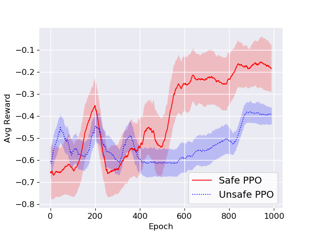

# Safe RL for surgery

<figure>
  
<figure>
 
## Folders:
- Unity: contains the Unity project, which has been modified to slightly adjust the observation space, the reward function and other minor details (e.g., the delta movement)
- Testing: contains the files to test the trained model in a built environment (env_fullbody) or in the editor. To test the model in the builded env just run "main.py", for the editor option, see line 64 of the main file.
 
## Pre-requisite (Tested on the following versions):
 ```
 mlagents: 0.20.0
mlagents-envs: 0.20.0
gym-unity: 0.20.0
gym: 0.20.0
tensorflow: 2.3.0
tensorboard: 2.7.0
```
<figure>
  
<figure>

<figure>
  
<figure>
 
 
# References
 https://ieeexplore.ieee.org/document/9636175
 ```
 @inproceedings{pore2021safe,
  title={Safe Reinforcement Learning using Formal Verification for Tissue Retraction in Autonomous Robotic-Assisted Surgery},
  author={Pore, Ameya and Corsi, Davide and Marchesini, Enrico and Dall’Alba, Diego and Casals, Alicia and Farinelli, Alessandro and Fiorini, Paolo},
  booktitle={2021 IEEE/RSJ International Conference on Intelligent Robots and Systems (IROS)},
  pages={4025--4031},
  year={2021},
  organization={IEEE}
}
```

